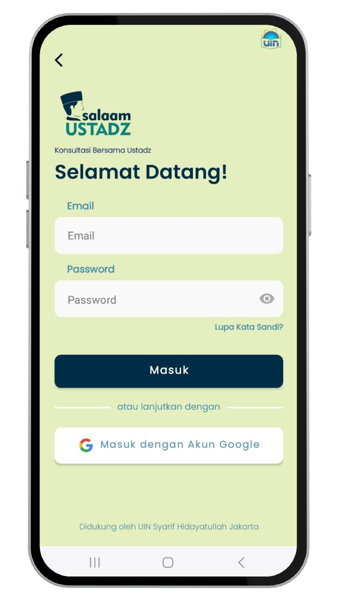

SalaamUstadz App
===================================

Salaam Ustadz is an innovative religious consultation service application. Supported by the expertise and knowledge of renowned religious scholars, 
this application aims to provide spiritual guidance and answers to religious questions in an easy, fast, and accurate manner.

This code demonstrates the Android Architecture component- ViewModel, DI and LiveData.
Tech Stack in this project:
1. Firebase
2. Retrofit
3. Navigation Component
4. Glide
5. Timber
6. Koin

Getting Started
---------------

1. [Download](https://s.id/Aplikasi-SalaamUstadz) and run the app.
2. Creating an Account.
3. Logging In.
4. Navigating the App.
5. Starting a Consultation!

Prototype
---------------
[Prototype](https://salaamustadz.my.canva.site)

Screenshoot
---------------

Splash Screen             |  Sign In
:-------------------------:|:-------------------------:
  |  

Home          |  Consultation
:-------------------------:|:-------------------------:
  |  

Article          |  Guidance on Worship
:-------------------------:|:-------------------------:
  |  

Prayer          |  Quran
:-------------------------:|:-------------------------:
  |  

Doa          |  Dzikr
:-------------------------:|:-------------------------:
  |  

Profile          |  
:-------------------------:|:-------------------------:
  | 
